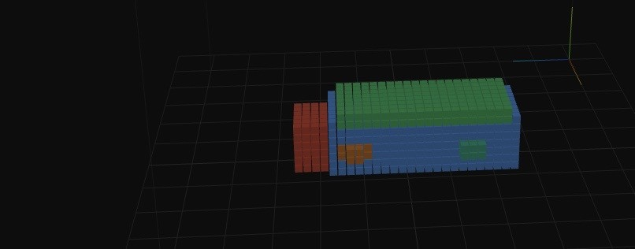
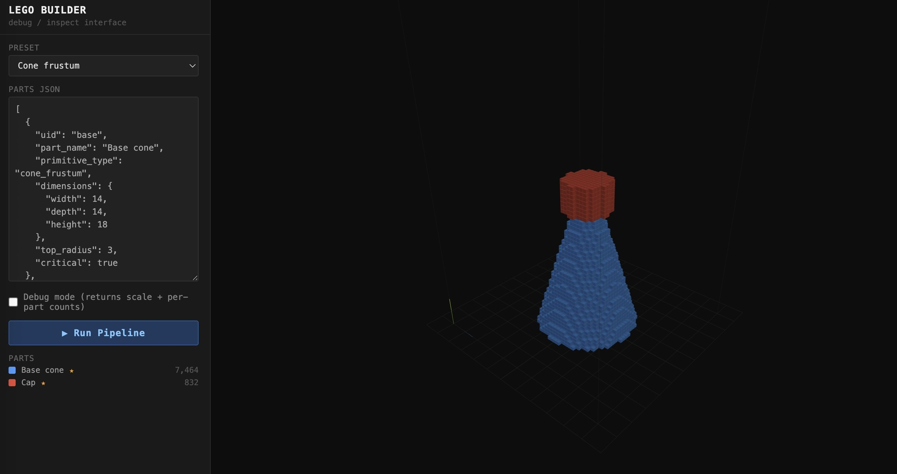

# lego-ai-builder

Turns a text description or an image into a 3D voxelized LEGO-style model you can inspect in the browser.

Gemini 2.5 Pro decomposes the input into primitive parts (cuboids, cylinders, ellipsoids, cone frustums) with attachment relationships. A deterministic 12-stage geometry pipeline places, scales, rotates, and voxelizes those parts onto a 100x100x100 grid. The server renders six orthographic views of the result, sends them back to the model for self-validation, applies the suggested edits, and serves the final grid to a Three.js viewer.



## Setup

Requires Python 3.11+ and a Gemini API key.

```bash
pip install -r requirements.txt
echo "GEMINI_API_KEY=your-key-here" > .env
uvicorn server:app --reload
```

Open http://localhost:8000 in a browser. Type a description (or upload an image), and the viewer displays the generated model.

## API

The frontend uses three endpoints. All accept and return JSON.

### POST /api/generate

Runs the full pipeline. Provide a `description`, a base64 `image` (raw base64 or a `data:image/...;base64,...` URL), or both.

```json
{ "description": "a school bus" }
```

Returns the voxel list, part metadata, stats, and a `session_id` for follow-up calls.

### POST /api/feedback

Refines an existing model using the session's stored context.

```json
{ "session_id": "...", "feedback": "make the wheels bigger" }
```

### POST /api/export

Exports the finalized model for a session.

```json
{ "session_id": "...", "format": "voxel_json" }
```

Lower-level endpoints (`/api/run`, `/api/validate`) run the geometry pipeline directly from a parts list and back the debug interface. `/telemetry` serves a dashboard of pipeline timings and LLM call stats.

## Architecture

1. **Input**: text description, or image described by Gemini vision and merged with any text.
2. **Parts generation**: Gemini 2.5 Pro returns a `part_types` + `instances` JSON structure, expanded server-side into a flat part list with parent/child face attachments.
3. **Geometry pipeline** (`pipeline.py`, deterministic, no LLM): 12 stages, in order:
   1. `validate_graph` - structural validation of the part graph
   2. `enforce_critical_closure` - ancestors of critical parts become critical
   3. `enforce_single_root` - merge multiple roots under a single root
   4. `attach_parts` - resolve face attachments to world centers
   5. `compute_scale` - uniform scale factor to fit the grid
   6. `apply_scale` - scale all part states
   7. `final_placement` - center on the grid, ground at Z=0
   8. `apply_rotation` - hierarchical rotations about attachment anchors
   9. `voxelize` - rasterize each primitive into voxel claims
   10. `apply_ownership` - resolve overlapping claims to one owner
   11. `critical_restoration` - restore critical parts that voxelized to zero
   12. `enforce_connectivity` - flood fill and bridge disconnected islands
4. **Self-validation**: the server renders six orthographic views (`render.py`), sends them back to Gemini, and applies the returned structural and local edits within fixed budgets, then rebuilds.
5. **Viewer**: Three.js frontend (`static/`) renders the voxel grid with per-part colors; a debug interface exposes the raw parts JSON and per-part voxel counts.



See SPEC.md for the detailed design document, including the coordinate system, attachment model, and edit grammar.

## Tests

```bash
pytest
```

`test_pipeline.py` covers the geometry pipeline stages; `test_render.py` holds golden tests for the orthographic projections.
